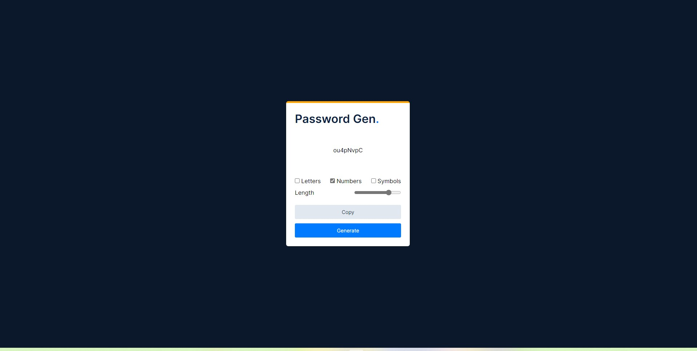

# Password Generator

## About The Project
It is a simple javascript project which geerates a random password according to the users need. 

There are many options to select like include only numbers, include only symbols, include only small letters or capital letters, combinations of theses are also allowed.

We can choose the length of the password, minimum is 5 and maximum is 20.

Another feature is to copy the password to clipboard.

## Tech Stacks Used

## Screenshots

## Live Demo

