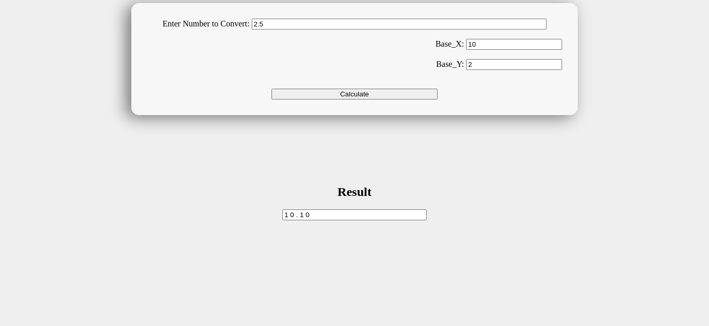

# BaseX Calculator

A calculator that can convert numbers from base-X to base-Y. Example: `` Decimal to Binary ``, `` Binary to Octal ``, `` Base 3 to Base 6 ``, ..etc.

## Tech Stack

- HTML
- CSS
- Javascript

## Screenshot

