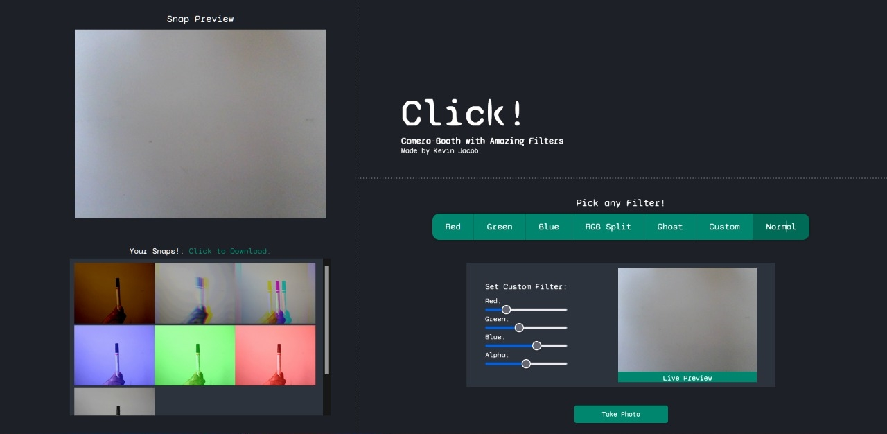

# Camera-Booth with Filters

## About The Project
This is a simple Javascript website, that takes in live webcam footage and applies filters to it.
 
You can then take a picture with or without using the different filters available. 

Though permission is required to access the webcam. If denied by mistake a simple reload can bring back the prompt.
 
There are 5 pre-defined filters and an option to make a custom filter based on your liking. 
Select the filter with just a click.

After taking a picture the picture gets added to a clipboard.
 
You can download the picture from the clipboard with just a click and it will prompt you to save it to your device.
 
The pictures in the clipboard are lost once the page is refreshed.

## Tech Stacks Used

## Screenshots

## Try the website right now!

https://itaintkevin.github.io/Click
