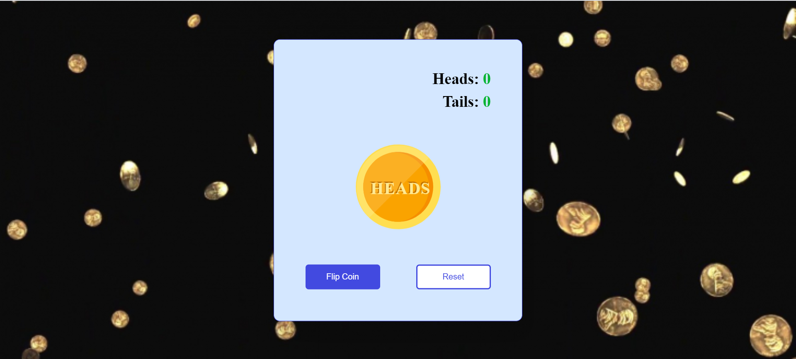

# Coin Toss App

## About The Project

It is a virtual coin toss app built using Javascript.This code simulates a coin flip that produces heads or tails with a cool 3D Animation. 

It also maintains the heads and tails count. We can also reset the count of heads and tails using reset button.

## Tech Stacks Used

## Screenshots

## Live Demo

