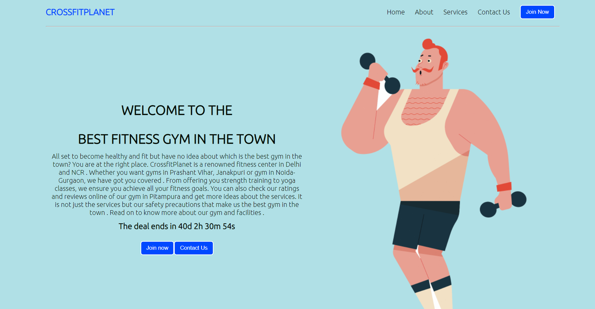
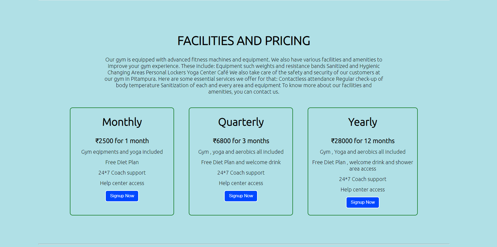
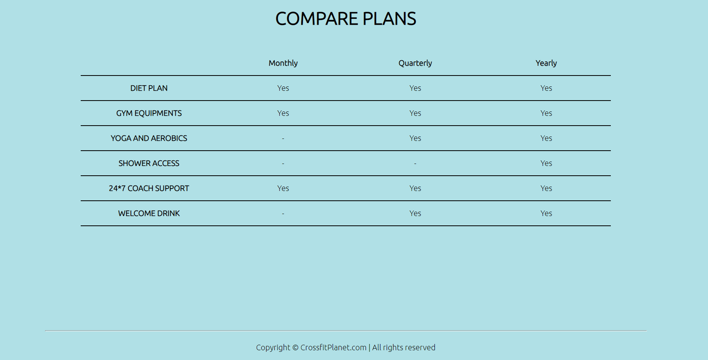

# CrossfitFitnessWebsite-main
 # CrossfitFitnessWebsite-main

<h2>Made by : Muskaan Mishra</h2>

<h2>About the Project:</h2> 

Hello Everyone👋

 I have tried to create a cool landing page of a fitness gym-Crossfit by using HTML , CSS and JAVASCRIPT.

The landing page provides all the information regarding the services of the gym with all the prices mentioned. I have even created a live timer using javacript.

## Tech Stacks Used :

<h2>Live Link For The Project:</h2>

https://crossfitplanet.netlify.app/

<h2>Screenshots of the Project:</h2>

 
 

 
 

 
 

