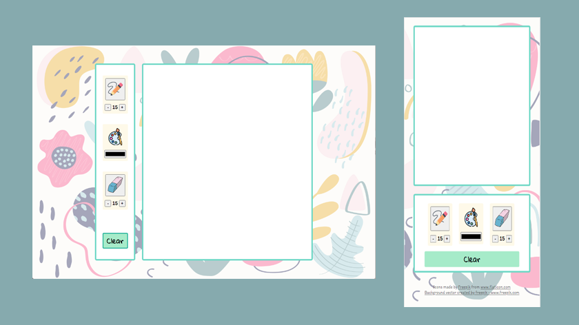
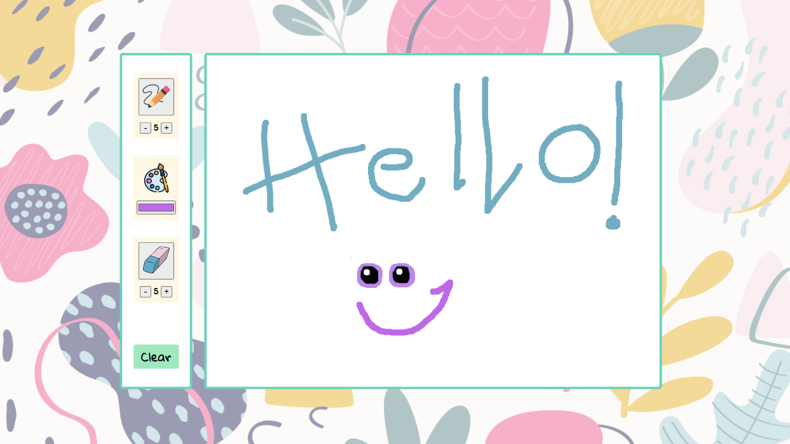

# Drawing App with HTML5 Canvas, CSS3 and JavaScript

 
This is a canvas-based drawing app created using HTML5 canvas, CSS3 and JavaScript without the use of frameworks or libraries. 

<h1>Features:</h1>
<ul>
  <li>Pencil</li>
  <li>Colour picker to draw different colour lines</li>
  <li>Pencil size chooser to draw with different line widths</li>
  <li>Eraser</li>
  <li>Eraser size chooser to erase with different line widths</li>
  <li>Clear button</li>
</ul>

This simple Drawing App is responsive and uses touch events and mouse events so you can draw with a mouse or touch on a desktop browser or mobile.

 

