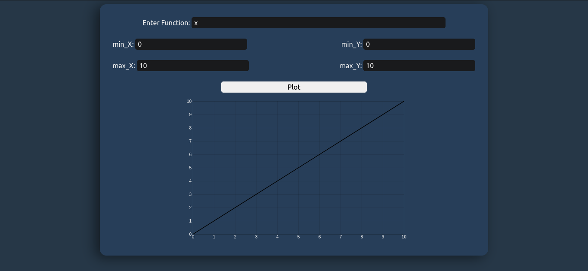

# Function Plotter

A JS app that takes a function and x-y ranges then plot them on a interactive canvas

- Handles semi-complex equations.
- Free to adjust ranges of X & Y.

## Built with :-

- HTML
- CSS
- Javascript
- Bootstrap5

## Screenshot :-

