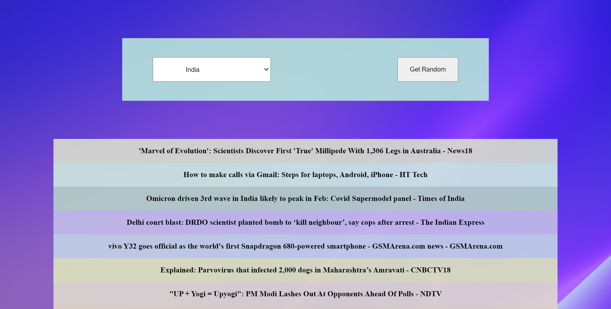

# Headlines

## About The Project

It is a game having 4 levels, each having different number of blocks. A colour with its rgba value will be provided and user has to guess the block with same colour.

When user select the correct block, the game over and ask to play again.

## Tech Stacks Used

## Screenshots

## Live Demo

## Visit Website

https://abaran803.github.io/WebDev-ProjectKart/Headlines/