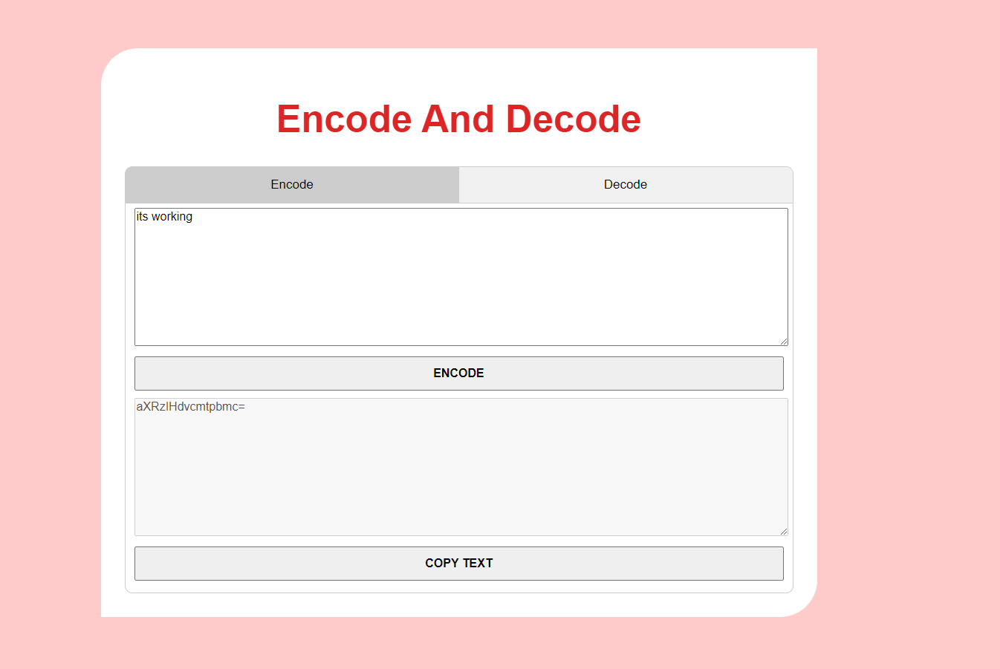
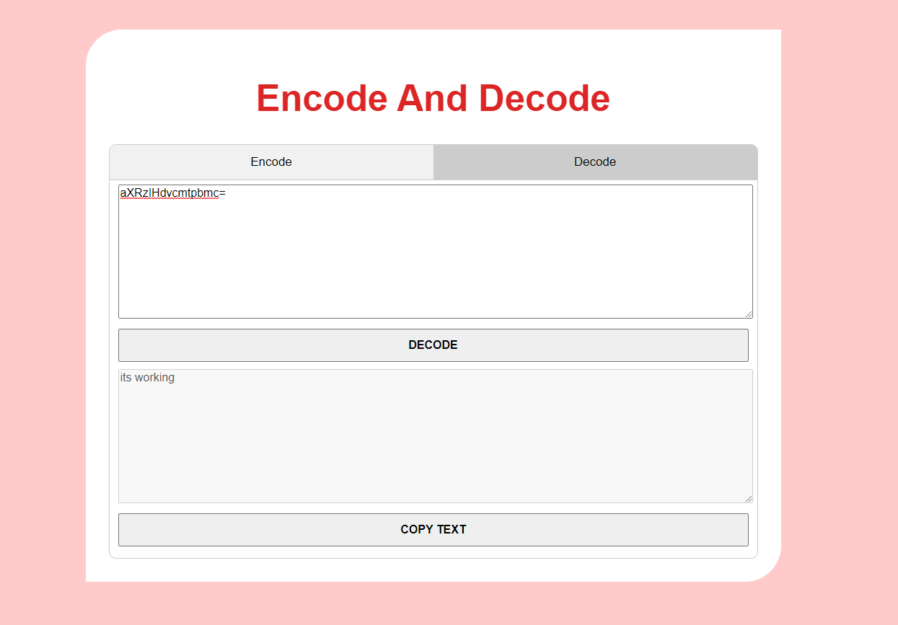

    
  </a>

<h1 align="center">Encode And Decode </h1>

 Encode And Decode made using HTML, CSS,JS.

 

  <!-- Standard -->
  

## ⚡️  Introduction
Encoder And Decoder

# Tech Stack Used:
  - HTML
  - CSS
  - JavaScript
  
## 📷 Screenshots

