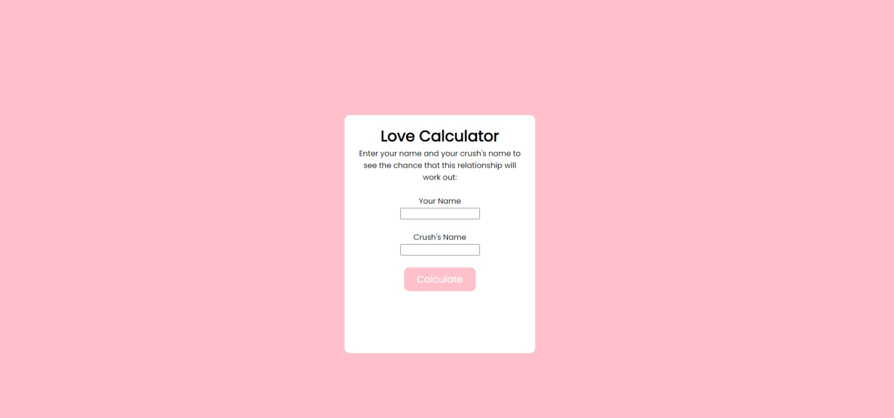
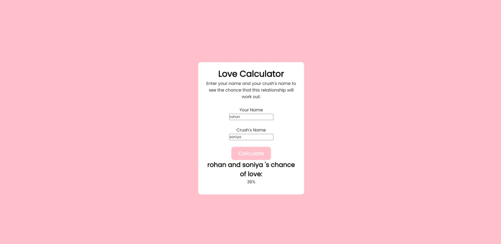

    
  </a>

<h1 align="center">Love Calculator</h1>

  Calculate your love by Love Calculator

 

  Learn by building simple projects, using HTML, CSS, JS.

 

  <!-- Standard -->
  

## ⚡️  Introduction
It is a love calculator made with html,css and js

## 📷 Screenshots

## ‎‍💻 Authors

- [@iamrahulmahato](https://www.github.com/iamrahulmahato)

## ⭐️ Show your support

Give a star if this project helped you!

