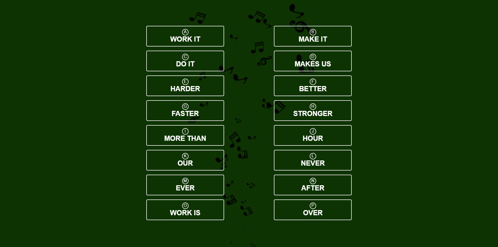

    
  </a>

<h1 align="center">Musical Click</h1>

  Musical Click made using HTML, CSS.

 

  <!-- Standard -->
  

## ⚡️  Introduction
Musical Click is a collection of music every click make new sound

## 📷 Screenshots

