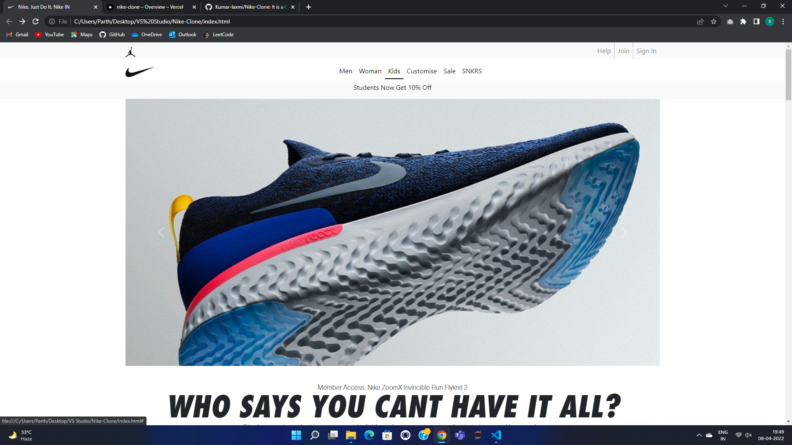
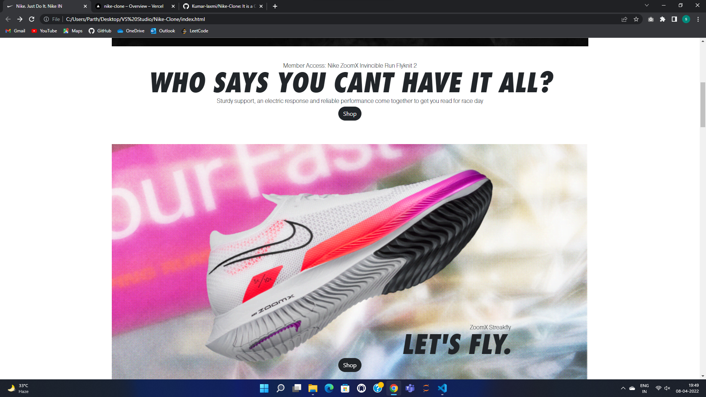

# Nike-Clone
It is a Clone of Nike Website

### Deployment
| Environment | Link |
|-------------|------|
| GitHub Pages | [GitHub Pages](https://kumar-laxmi.github.io/Nike-Clone/) |
| Vercel Preview | [Vercel Preview](https://nike-clone-3zpxwddmb-kumar-laxmi.vercel.app/) |
| Vercel Production | [Vercel Production](https://nike-clone-3zpxwddmb-kumar-laxmi.vercel.app/)

### Technology Stack
#### Languages:
- 
- 
- 

#### Frame-Works, PlatForm & Libraries:
- 
- 
- 

#### IDE Used:
- 

#### Version Control:
- 
- 

### Screen-Shot of Clone:

