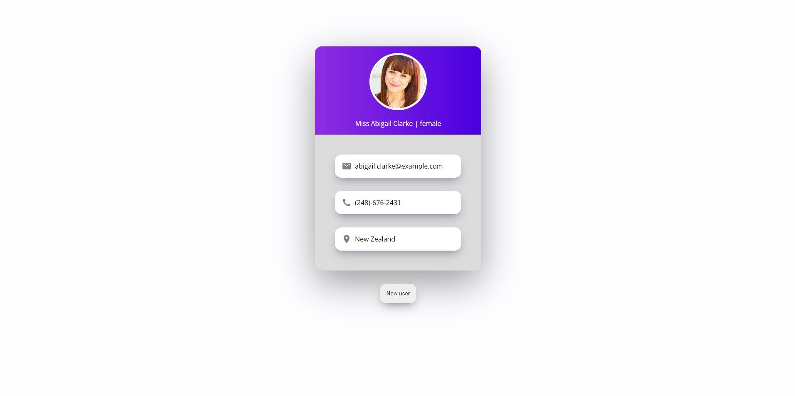
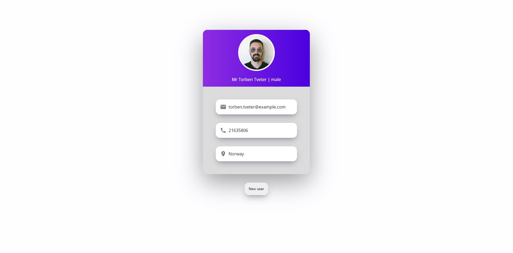

 

<h1 align="center">Random User Generator</h1>

  ✨ Generate Random user by a single click

 

## ⚡️ Introduction
Random User Generator is a platform where you can generate random user img,name,email,phone and location by a single click

## 🎯 Features

- Generate Random image
- Generate Random Name
- Generate Random Phone
- Generate Random loaction

## 📷 Screenshots

## ‎‍💻 Authors

- [@iamrahulmahato](https://github.com/iamrahulmahato)