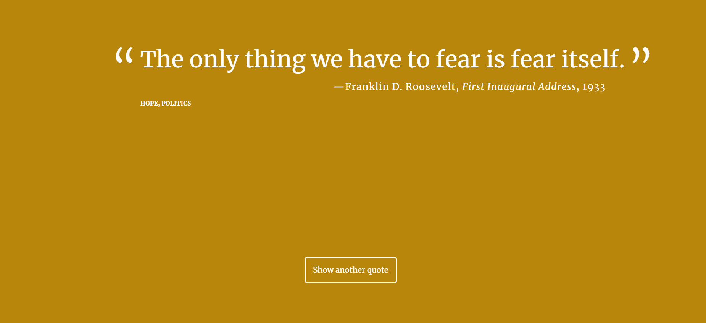

## Random Quote Generator

- JavaScript
- HTML
- CSS
- WebStorm
- GitHub 

# PROJECT SCREENSHOT
 

#### Requirements:
- [x] Create an array of JavaScript objects to hold the data for your quotes. 
	- [x] Name the array quotes. 
	- [x] The quotes array should be accessible in the global scope.
- [x] Each quote object in the quotes array should have 
	- [x] A quote property which contains a string: the text of the quote that will be displayed on the page.
	- [x] A source property which contains a string identifying the creator of the quote. For example: "Mark Twain" or "Traditional Irish proverb.”
	- [x] An optional citation property which contains a string identifying where the quote comes from, like a speech or publication. For example, "Famous Anonymous Jokes." 
	- [x] If there is no known publication, do not include this property on the object.
	- [x] An optional year property which contains a number identifying the date of the quote. For example, 1997. 
	- [x] If there is no known date, then do not include this property on the object.
- [x] Create a function named getRandomQuote which:
	- [x] selects a random quote object from the quotes array
	- [x] returns the randomly selected quote object
- [x] Create a function named printQuote which follows these rules:
	- [x] printQuote calls the getRandomQuote function and stores the returned quote object in a variable
	- [x] printQuote constructs a string containing the different properties of the quote object using the following HTML template:
```
<p class="quote"> [quote here] </p>
<p class="source"> [source here]
  <span class="citation"> [citation here] </span>
  <span class="year"> [year here] </span>
</p>
```

- [x] printQuote doesn't add a span for a citation if there is no citation property for the quote 
- [x] printQuote doesn't add a span for the year property for the quote
- [x] printQuote displays the final HTML string to the page. You can use this JS snippet to accomplish that:

```
document.getElementById('quote-box').innerHTML
```

- [x] Add comments to your code
- [x] Check for cross-browser compatibility with at least 3 browsers
	
Extra Credit Criteria

- [x] Add more properties to the quote object. For example, a tags property could include a list of "tags" like "humor", "business", or "politics" to categorize each quote.
- [x] When the quote changes, randomly change the background color of the page.
- [x] Don't display a random quote more than once until ALL quotes from the array have been displayed. 
- [x] To help reviewers (and yourself) verify that the quotes don’t repeat until they’ve all been displayed, log the quote to the console each time the “Show Another Quote” button is clicked.
- [x] Refresh the quote after a set amount of time. For example, every 30 seconds, make a new quote appear. (You can use the setInterval() or setTimeout() method to do this.


### Resources
- [setInterval](https://developer.mozilla.org/en-US/docs/Web/API/WindowTimers/setInterval)
- [setTimeout](https://developer.mozilla.org/en-US/docs/Web/API/WindowTimers/setTimeout)
- [Color names](http://www.w3schools.com/colors/colors_names.asp)

### Issues

Review the css with mobile first in mind.

Define media queries in terms of min-width

```
@media (min-width: 769px) {
	.container {
		width: 70%;
		max-width: 1000px;
		margin: 0 auto;
	}
}
```

For the random quotes website, I'll need to have an
even smaller min-width initially.

#### One Rule for All

```
* {
  box-sizing: border-box;
}
```
