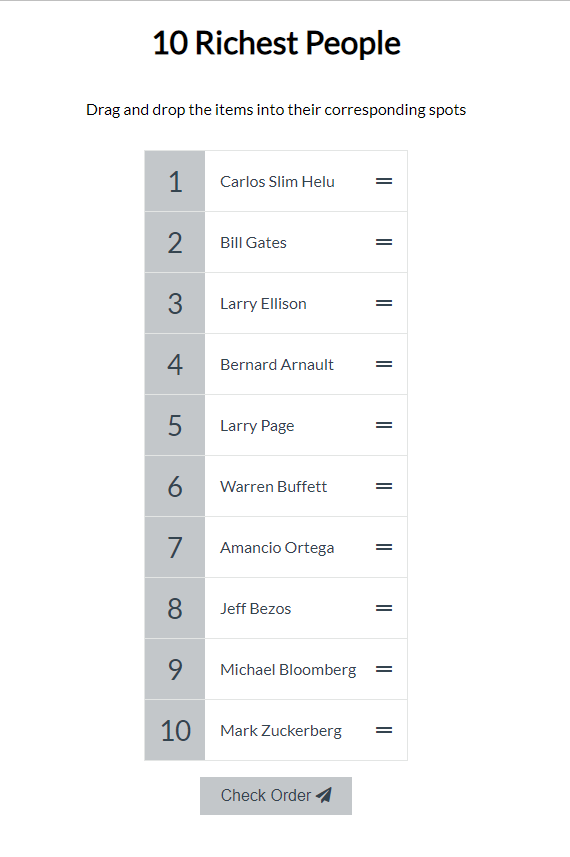
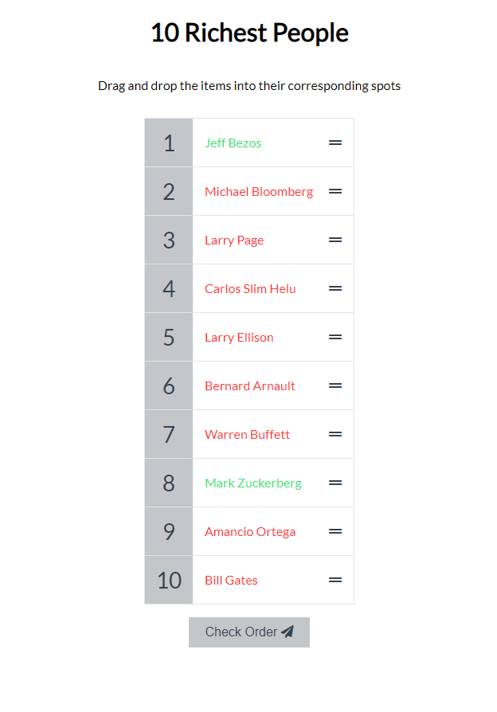

    
  </a>

<h1 align="center">Sortable List</h1>

Display a scrambled list that can be sorted with drag and drop

 

  <!-- Standard -->
  

## 🎮 How to play

- drag and drop an item to a different position
- check if items are in correct order by clicking check order
- Show green for correct order and red for wrong order

## 📷 Screenshots

)
