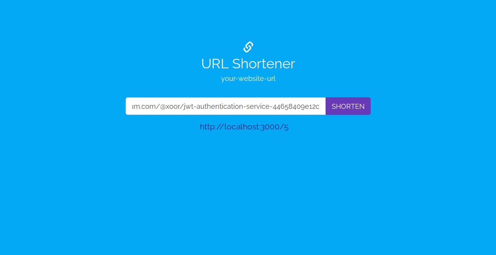

# Node ES6 URL Shortener


# Stack


# File structure

```
node-es6-url-shortener/
│
├── api/
│   ├── controllers/
│   │   └── UrlController.js
│   │
│   ├── models/
│   │   └── Url.js
│   │
│   └── helpers/
│      └── base58.js
│
├── config/
│   ├── env/
│   │   ├── development.js
│   │   ├── index.js
│   │   ├── production.js
│   │   └── test.js
│   │
│   ├── routes/
│   │   ├── index.js
│   │   └── url.js
│   │
│   ├── express.js
│   └── sequelize.js
│
├── view/
│   ├── css/
│   │   └── styles.css
│   │
│   ├── javascript/
│   │   └── shorten.js
│   │
│   └── index.html
│
├── test/
│   └── url.test.js
│
├── .eslintrc                     * ESLint configuration file
├── .gitignore                    * Example git ignore file
├── index.mjs                     * Entry point of our Node's app
├── package.json                  * Defines our JavaScript dependencies
├── package-lock.json             * Defines our exact JavaScript dependencies tree
└── README.md                     * This file
```

# Screenshot

<p align="center">
  
</p>

# Introduction

## What's a URL Shortener?

 URL shortening is a technique to convert a long URL (site or page address) to a shorter version. This shorter version of the URL is usually cleaner and easier to share or remember. When someone accesses the shortened address, the browser redirects to the original (large) url address. It is also called URL redirection or URL redirect.

For example, the large version of this url:
http://en.wikipedia.org/wiki/URL_shortening

Can be shortened with bit.do service to this small address, that redirects to the previous longer address:
http://bit.do/urlwiki

## How does it work?

Essentially, your database has 3 fields: `primaryKey`, `shortCode` and `targetURL`.

Normally the `shortCode` is simply the `primaryKey` (which is an int) converted to another base. So for instance base 36 (so 0 through 9, and then 'a' through 'z').

This makes it easy to look up the `targetURL` in the database, since you can just decode it to base 10 and find the primary key.

You will also have short URLs since the number of URLs you can have is 36^n where n is the number of characters in the shortened URL. So you can see that just with 4 letters you can have a possible of 2,313,441 different URLs. If you use capital letters (a larger base), this gets even larger. 

## How to use this code?

1. Make sure you have the latest stable version of Node.js installed

```
$ sudo npm cache clean -f
$ sudo npm install -g n
$ sudo n stable
```

2. Configure your database and jsonwebtoken in `config/env`. For example `config/env/development.js` would look like this:

```js
module.exports = {
  mysql: {
    host: 'localhost',
    port: 3306,
    database: 'shortener_dev',
    username: 'root',
    password: '',
  }
};
```
  
