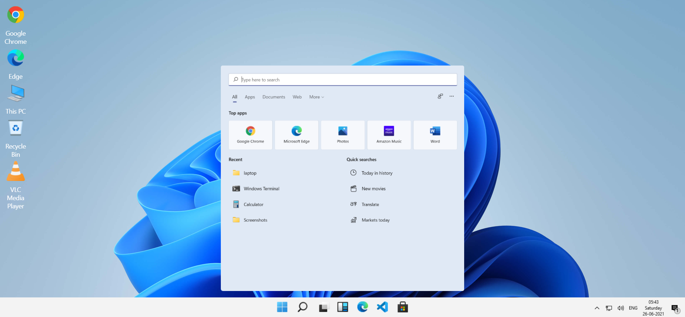
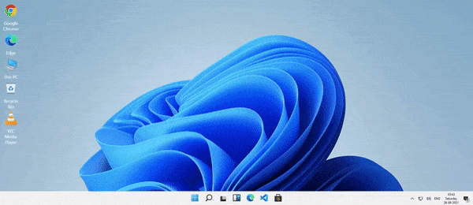

<h1> Windows 11 Clone</h1>

<h2>Made by : Muskaan Mishra</h2>

<h2>About the Project:</h2> 

Hello Everyone👋

 I have tried to create a simple yet elegant interface which is similar to that of Windows 11 by using HTML , CSS and JAVASCRIPT.

You can even click on the Start , Search and Widgets Icon and the respective menu will pop up on your browser . A demo for the same is provided below.

## Tech Stacks Used :

<h3>Steps to Use:</h3>

- Download or clone the repository
- Go to the directory
- Run the index.html file
- Click on the start , search or widget icon present in the taskbar.
- A pop up menu for the same will appear in your browser.

<h2>Screenshots of the Project:</h2>

 
 

 
 

 
 

 
 

<h2>Demo of the Project:</h2>

