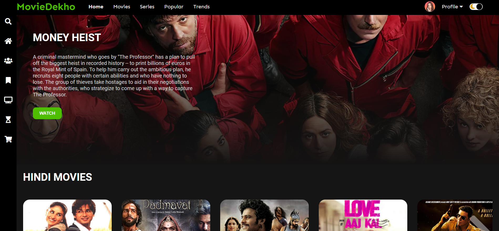
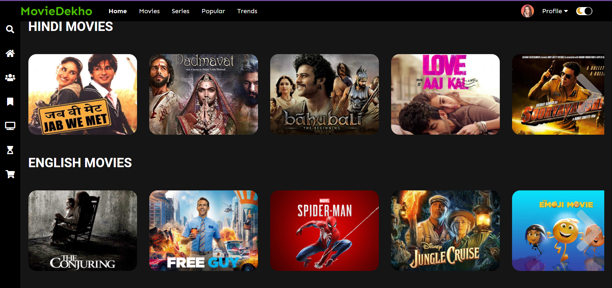
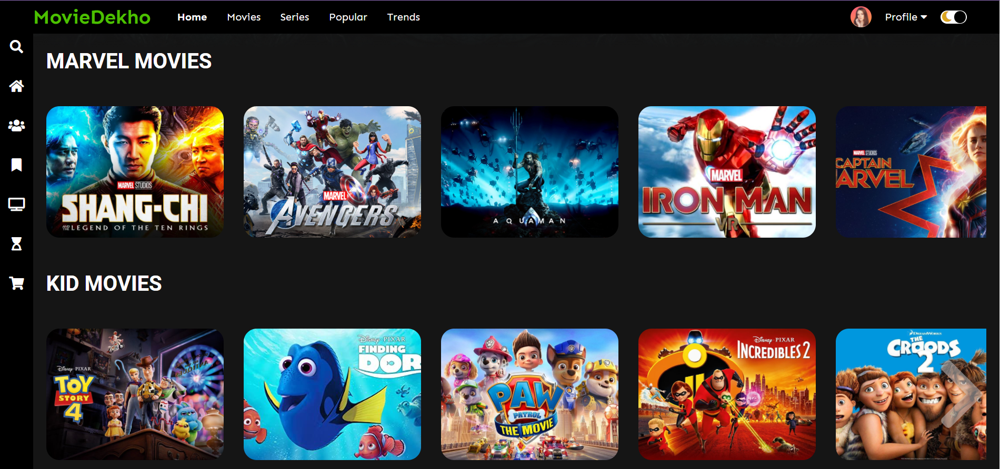

 <h1>Movie Website-MovieDekho</h1>

<h2>Made by : Muskaan Mishra</h2>

<h2>About the Project:</h2> 

Hello Everyone👋

 I have tried to create a movie website similar to netflix by using HTML , CSS and JAVASCRIPT.

You can click on the particular movie poster to get infomation about the movie . You can also switch to dark mode or light mode by clicking on the mode switch button present on the top right corner . A demo for the same is provided below.

## Tech Stacks Used :

<h3>Steps to Use:</h3>

- Download or clone the repository
- Go to the directory
- Run the index.html file
- Click on the movie poster to know about the particular movie.
- Click on the mode button to switch to dark mode or light mode according to your preference.

<h2>Live Link For The Project:</h2>

https://moviedekhoo.netlify.app/

 
<h2>Screenshots of the Project:</h2>

 
 

 
 

 
 

<h2>Demo of the Project:</h2>
 

