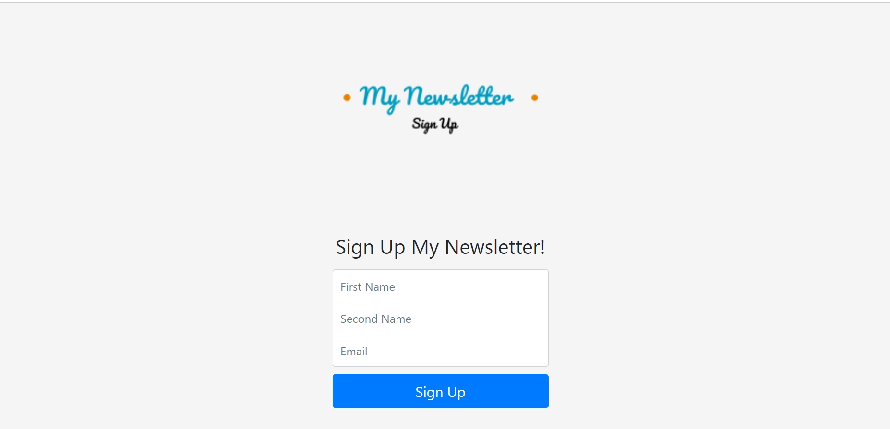

# Newsletter Signup Page

This is a basic signup page which I created using the basic
techstack required
* HTML5
* CSS3
* JS
* node.JS


## Description

The main idea of creating this is nothing special. I am new to API calling.
So had the urge to use it and so I used the **mailchimp** postletter API and the page 
is designed using the stacks referred above.


## Images




Using the features provded in the app you will be signed up to the newsletter for free.


### It is already deployed using Heroku and the link is provided below
[Newsletter_signup_page](https://dry-bayou-93262.herokuapp.com/)
## API Reference

#### Get all items

```http
  https://us10.api.mailchimp.com/3.0/lists/50d002886f
```

| Parameter | Type     | Description    |
| :-------- | :------- | :------------- |
| `api_key` | `string` | **Required**.  |

#### Get item


